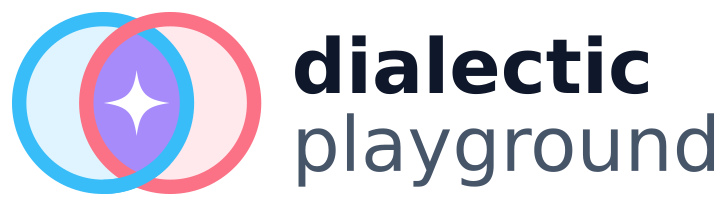
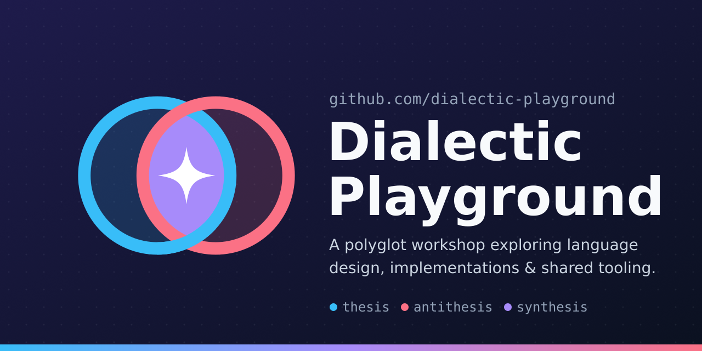
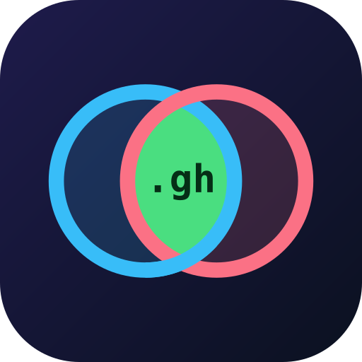
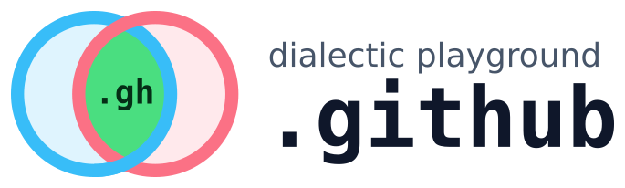
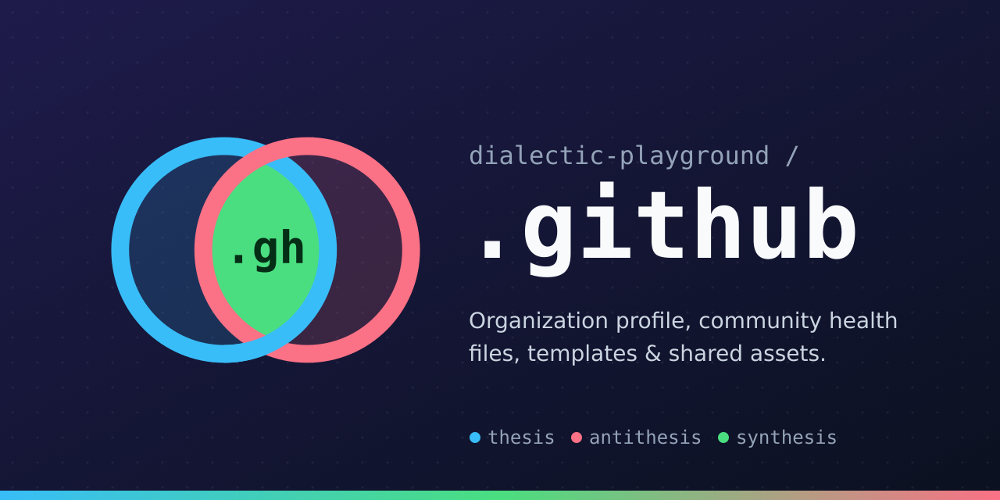
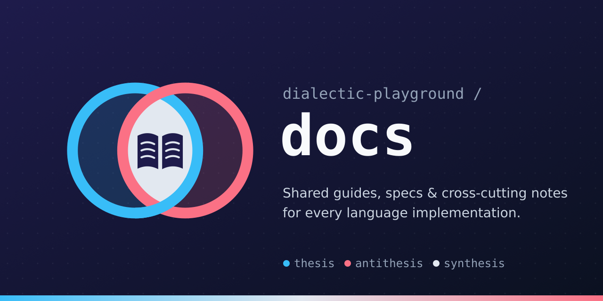

# Brand assets

Icons, logos, and social previews for the **Dialectic Playground** organization and its
repositories. Every image comes from one shared "core" design, so each repository gets its own
variant of the same identity.

| Set | Icon | Logo | Social preview |
| :-- | :--: | :--: | :--: |
| [`dialectic-playground`](dialectic-playground/) (org) |  |  |  |
| [`dot-github`](dot-github/) (`.github`) |  |  |  |
| [`docs`](docs/) |  |  |  |

---

## The design

The mark is a small picture of a dialectic:

| Element | Meaning | Color |
| :-- | :-- | :-- |
| Left ring | **Thesis** | sky `#38BDF8` (fixed) |
| Right ring | **Antithesis** | rose `#FB7185` (fixed) |
| Overlapping lens | **Synthesis**: the space where ideas (and languages) meet | per-repo **accent** |
| Glyph in the lens | What this particular repository is | per-repo glyph + glyph color |

The rings interlock: rose passes over sky at the top crossing and sky passes over rose at the
bottom. Neither side dominates.

**Every variant keeps the same rings, layout, background, and typography.** Only these change:

1. `ACCENT`: the lens fill (plus the matching dot and gradient stop on the social preview)
2. `GLYPH_TEXT` *or* `GLYPH_FILE`: the symbol in the lens
3. `GLYPH_COLOR`: the glyph's fill
4. The name and tagline text

This means a new repository can be added without any design work, and all assets stay
recognizably part of one family.

### Fixed palette

| Role | Value |
| :-- | :-- |
| Background gradient (icon, social) | `#1E1B4B` → `#0B1120` |
| Thesis / antithesis rings | `#38BDF8` / `#FB7185` (16% fill inside each ring) |
| Wordmark ink (light / dark) | `#0F172A` / `#F1F5F9` |
| Wordmark muted (light / dark) | `#475569` / `#94A3B8` |
| Social preview title / tagline / caption | `#F8FAFC` / `#CBD5E1` / `#94A3B8` |

### Typography

- **Monospace** (repo names, text glyphs, captions): `JetBrains Mono`, falling back to
  `DejaVu Sans Mono`, Menlo, Consolas, `monospace`
- **Sans** (organization wordmark, taglines): `Inter`, falling back to Segoe UI, `DejaVu Sans`,
  Helvetica Neue, Arial, `sans-serif`

The `dist/*.svg` files have their text **converted to paths**, so they look the same everywhere
whether or not the viewer has these fonts. They are drawn in whichever font was installed on the
machine that ran the generator. The current files were rendered with the DejaVu fallbacks. To
get the intended fonts, install JetBrains Mono and Inter (both under the SIL Open Font License)
and regenerate. The generator prints a note when either one is missing.

### Palette registry

Accent colors already in use, plus suggestions for planned repositories. Language accents come
from each language's recognizable brand color, adjusted where needed so they show up on the dark
background. Language glyphs are short **text** (not official logos), which avoids trademark and
usage-policy issues. Pick an accent that is clearly different from the thesis and antithesis
ring colors and from the other entries here.

| Slug | Repo | Accent | Glyph color | Glyph | Status |
| :-- | :-- | :-- | :-- | :-- | :-- |
| `dialectic-playground` | *(org)* | `#A78BFA` violet (sky + rose = synthesis) | `#FFFFFF` | `spark` file | ✅ created |
| `dot-github` | `.github` | `#4ADE80` green | `#052E16` | `.gh` | ✅ created |
| `docs` | `docs` | `#E2E8F0` paper | `#1E1B4B` | `book` file | ✅ created |
| `py` | `py` | `#4B8BBE` | `#FFD43B` | `py` | suggested |
| `rs` | `rs` | `#DEA584` | `#1E1B4B` | `rs` | suggested |
| `go` | `go` | `#00ADD8` | `#FFFFFF` | `go` | suggested |
| `c` | `c` | `#A8B9CC` | `#1E1B4B` | `c` | suggested |
| `cs` | `cs` | `#9B4F96` | `#FFFFFF` | `c#` | suggested |
| `java` | `java` | `#F89820` | `#1E1B4B` | `jv` | suggested |
| `js` | `js` | `#F7DF1E` | `#1E1B4B` | `js` | suggested |
| `ts` | `ts` | `#3178C6` | `#FFFFFF` | `ts` | suggested |
| `php` | `php` | `#8892BF` | `#FFFFFF` | `php` | suggested |
| `rb` | `rb` | `#CC342D` | `#FFFFFF` | `rb` | suggested |

When you create a set, change its row to ✅ so this table remains the record of which accents
are taken.

---

## Layout

```
assets/
├── README.md                    ← this file
├── templates/                   ← the shared "core" design (edit here to change every set)
│   ├── asset.env.example        ← starting point for a new set's parameters
│   ├── icon.svg.tmpl            ← 512×512 rounded tile + mark
│   ├── logo.svg.tmpl            ← horizontal lockup: mark + wordmark (transparent, light/dark aware)
│   ├── social-preview.svg.tmpl  ← 1280×640 GitHub social card
│   ├── partials/
│   │   ├── mark.svg.tmpl        ← THE core mark (rings + lens + glyph slot), used by all three
│   │   ├── glyph-text.svg.tmpl  ← text glyph renderer (auto-sized for 1–3 characters)
│   │   ├── logo-text.{org,repo}.svg.tmpl
│   │   └── social-text.{org,repo}.svg.tmpl
│   └── glyphs/                  ← reusable shape glyphs (spark, book, …)
└── <slug>/                      ← one asset set per repository
    ├── asset.env                ← this set's parameters
    ├── icon.svg                 ← SOURCE (scaffolded from templates; may be hand-tuned)
    ├── logo.svg                 ← SOURCE
    ├── social-preview.svg       ← SOURCE
    └── dist/                    ← GENERATED by tools/generate-assets.sh: never edit by hand
        ├── icon.svg  icon-512.png  icon-256.png
        ├── apple-touch-icon.png  favicon-16x16.png  favicon-32x32.png  favicon.ico
        ├── logo.svg  logo-dark.svg  logo.png  logo-dark.png
        └── social-preview.svg  social-preview.png
```

The slug is the repository name. The one exception is `.github`, which uses `dot-github`:
directories starting with a dot are hidden and are skipped by shell globs such as `assets/*/`.
The real repository name lives in `REPO=` inside `asset.env`.

### Sources and generated files

The pipeline has two stages, and each one has its own source of truth:

```
templates/ + <slug>/asset.env ──scaffold-assets.sh──▶ <slug>/*.svg ──generate-assets.sh──▶ <slug>/dist/*
```

- `scaffold-assets.sh` writes the editable source SVGs, which keep their text live. It **never
  overwrites** an existing source unless you pass `--force`, so hand-tuning is safe.
- `generate-assets.sh` always regenerates `dist/` completely from the source SVGs. Output is
  deterministic (timestamps are stripped from PNGs), so re-running it only creates a git diff
  when something actually changed.
- Both stages are committed, so other repositories and GitHub settings can use the files
  directly.

### What each output is for

| File | Use |
| :-- | :-- |
| `dist/icon-512.png` | GitHub **organization avatar** (org set). Upload under *Settings → Profile*. |
| `dist/social-preview.png` | GitHub **repository social preview**. Upload under *Settings → General → Social preview*. GitHub has no API for this. |
| `dist/logo.svg` / `logo-dark.svg` | README headers (see snippet below) |
| `dist/logo.png` / `logo-dark.png` | Places that can't use SVG |
| `dist/favicon.ico`, `favicon-*.png`, `apple-touch-icon.png` | Documentation sites (e.g. a future GitHub Pages / MkDocs site for `docs`) |
| `dist/icon-256.png`, `dist/icon.svg` | General-purpose icons: badges, slides, package registries |

**Theme-aware README header.** Use this in a repository's `README.md`. It works on github.com
because it references this repository through absolute URLs:

```html
<picture>
  <source media="(prefers-color-scheme: dark)" srcset="https://raw.githubusercontent.com/dialectic-playground/.github/main/assets/docs/dist/logo-dark.svg">
  
</picture>
```

**Favicon tags** for a documentation site, after copying the `dist/` files into the site's root:

```html
<link rel="icon" href="/favicon.ico" sizes="48x48">
<link rel="icon" type="image/png" sizes="32x32" href="/favicon-32x32.png">
<link rel="icon" type="image/png" sizes="16x16" href="/favicon-16x16.png">
<link rel="apple-touch-icon" href="/apple-touch-icon.png">
```

---

## Adding assets for a new repository

Requirements: `bash`, `envsubst` (gettext), Inkscape ≥ 1.0, and ImageMagick (`magick` or
`convert`). `xmllint` is optional and validates the scaffolded SVGs.

Example for a new `rs` repository:

```bash
# 1. Create assets/rs/asset.env from the example template (nothing is rendered yet)
tools/scaffold-assets.sh rs

# 2. Edit assets/rs/asset.env: set ACCENT/GLYPH_COLOR from the palette registry above,
#    GLYPH_TEXT="rs", and the two TAGLINE lines (≤ 42 characters each)

# 3. Scaffold the source SVGs from the templates
tools/scaffold-assets.sh rs

# 4. Render dist/
tools/generate-assets.sh rs

# 5. Review the PNGs in assets/rs/dist/, update the palette registry row to ✅, then commit
```

### Making changes

| You want to… | Do this |
| :-- | :-- |
| Change something for **every** set (ring colors, layout, background) | Edit `templates/` → `tools/scaffold-assets.sh --force --all` → `tools/generate-assets.sh` |
| Change one set's accent, glyph, or tagline | Edit `<slug>/asset.env` → `tools/scaffold-assets.sh --force <slug>` → `tools/generate-assets.sh <slug>` |
| Hand-tune one set's artwork | Edit `<slug>/*.svg` directly (in Inkscape or a text editor) → `tools/generate-assets.sh <slug>`. **Don't** run `scaffold-assets.sh --force` on that set afterwards, or your edits will be overwritten. |
| Add a shape glyph instead of text | Add `templates/glyphs/<name>.svg` (see below) and set `GLYPH_FILE="<name>"` |

**Before re-scaffolding with `--force`, check `git diff`.** If a set's source SVGs have been
hand-tuned, `--force` overwrites those edits.

### Writing a glyph file

A glyph is an SVG *fragment*, not a complete document. It is pasted into the lens of
`partials/mark.svg.tmpl`.

- Draw it centered on `(0, 0)` and keep it inside roughly **±50 units** horizontally and
  **±45 units** vertically. The lens is narrow at the top and bottom.
- Use `${GLYPH_COLOR}` for the main fill and `${ACCENT}` for "cut-out" details. Both are
  substituted at scaffold time.
- Keep it bold and simple. The same glyph has to read at 32×32 px.

See `templates/glyphs/book.svg` and `templates/glyphs/spark.svg`.

### Constraints and gotchas

- **Text glyphs**: 1–3 characters. The font size scales automatically: 96px for 1 character,
  83px for 2, 55px for 3.
- **Taglines**: at most about 42 characters per line at 28px. SVG text doesn't wrap, so the
  scaffold script warns when a line is longer.
- **Long repo names**: the title font shrinks automatically in the logo and social preview.
- **Logo dark variant**: the generator replaces the `/*@theme-override*/` CSS marker in
  `logo.svg`. Keep that marker, and the `dp-ink` / `dp-muted` classes, when hand-editing.
- **apple-touch-icon**: rendered from a copy of `icon.svg` with the `dp-tile` rectangle's corner
  radius set to 0, because iOS applies its own mask. Keep `class="dp-tile"` on the background
  rect.
- **Favicons at 16px** are inevitably soft: the rings become two colored arcs around the accent.
  If a crisper 16px favicon is ever needed, add a simplified `favicon.svg` source and a matching
  step in the generator.
